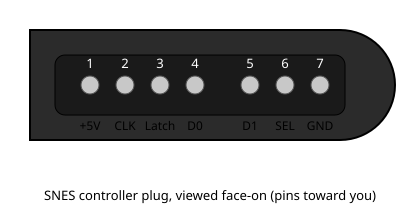
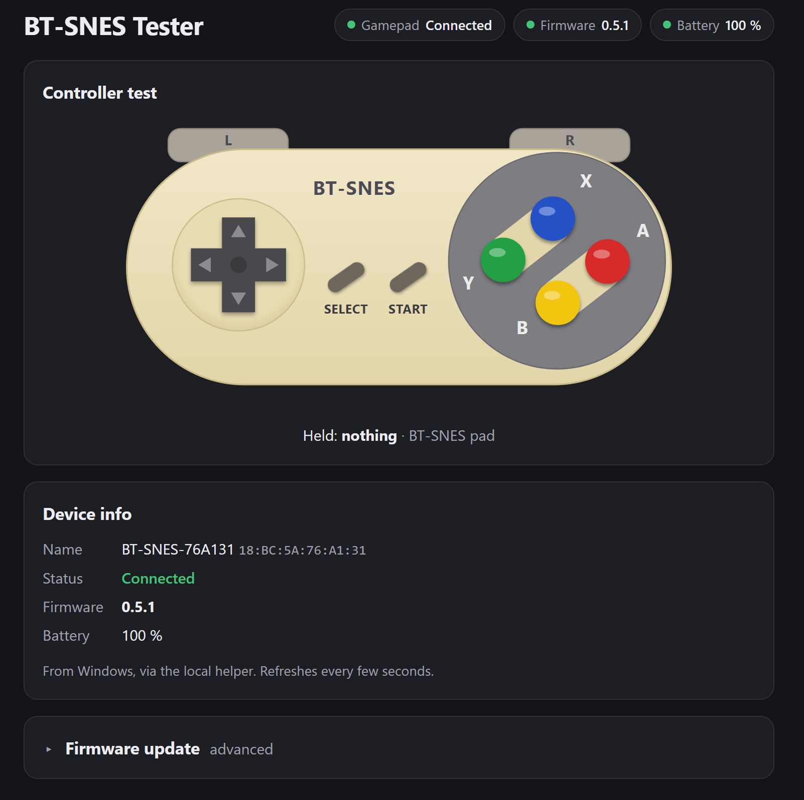
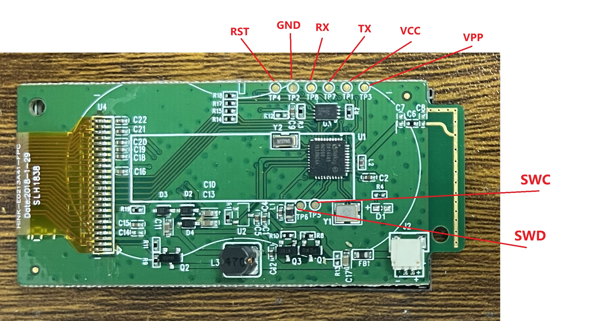

# BLE_HID - SNES Gamepad over HID-over-GATT (DA14585)

A BLE HID device for the DA145xx SDK. It exposes a standard **HID gamepad**
(HID over GATT Profile, Device role - HOGPD) emulating an SNES pad. It pairs and
bonds with BLE HID hosts (Windows, Android, iOS, Linux).

## Overview

- **Profile**: HID Service (UUID 0x1812) via the SDK `hogpd` profile (device role)
  - Report Map: USB HID Game Pad, Report ID 1, 12 buttons (`hid_report_map`, 31 bytes)
  - 1 input report (2 bytes: 16-bit little-endian button bitmap, bits [11:0] used), notifiable
  - HID Information (bcdHID 1.01, normally connectable, remote wake)
  - Protocol Mode characteristic, Report protocol only (no boot reports; a host request
    for Boot protocol is refused, since HOGPD would then reject every input report)
- **Device Information Service** (0x180A, SDK `diss` + `app_diss`): manufacturer
  `motionfxdesign`, model `BT-SNES`, firmware revision = `APP_VERSION`, PnP ID (VID 0xFFFF /
  PID 0x0001 - unassigned placeholder, version = `APP_VERSION_BCD`). Windows shows the version
  in Device Manager > the pad's HID device > Details > Hardware Ids as `REV&0030` (v0.3.0);
  BLE tools (nRF Connect) show the Firmware Revision string. Hosts cache this at pairing, so
  re-pair to see a new version.
- **Buttons** (`SNES_BUTTON_*` in `src/user_hid_hogpd.h`), bit 0 to 11:
  A, B, Select, Start, D-pad Up, Down, Left, Right, X, Y, L, R
- **GAP**: peripheral, general discoverable; advertising data carries the HID
  service UUID, gamepad appearance (0x03C4), and the device name. The name is built
  at runtime as `BT-SNES-XXXXXX`, where `XXXXXX` is the last 3 octets of the chip's
  own BD address (`dev_bdaddr`) so multiple pads are distinguishable
  (`user_app_adv_set_name()` in `src/user_hid.c`; `USER_DEVICE_NAME` in
  `user_config.h` is deliberately left empty).
- **Security**: pairing and bonding are mandatory for HID hosts.
  Just Works (`GAP_IO_CAP_NO_INPUT_NO_OUTPUT` + `GAP_AUTH_BOND | GAP_AUTH_SEC`),
  unauthenticated pairing with encryption (`GAP_SEC1_NOAUTH_PAIR_ENC`), security
  requested on connect (`DEF_SEC_REQ_ON_CONNECT`). Bond data is stored by the SDK
  default bond database.

The SDK provides the HOGPD profile task but no application module for it, so the
application supplies the glue in `src/user_hid_hogpd.c`:

- `app_hogpd_create_db()` - sends `GAPM_PROFILE_TASK_ADD_CMD` with a
  `struct hogpd_db_cfg` payload (registered in `user_prf_funcs[]`,
  see `src/config/user_callback_config.h`)
- `app_hogpd_enable()` - sends `HOGPD_ENABLE_REQ` on each connection
- message handlers for `HOGPD_NTF_CFG_IND`, `HOGPD_REPORT_REQ_IND`,
  `HOGPD_PROTO_MODE_REQ_IND`, `HOGPD_CTNL_PT_IND`, `HOGPD_REPORT_UPD_RSP`,
  dispatched from `user_catch_rest_hndl()` in `src/user_hid.c`. `HOGPD_CTNL_PT_IND`
  (HID Control Point Suspend/Exit-Suspend) pauses/resumes the SNES poll timer; the suspend
  is remembered until Exit-Suspend or the next connection.

## Project layout

```
BLE_HID/
├── Keil_5/BLE_HID.uvprojx      1 target: DA14585
└── src/
    ├── user_hid.c/.h           GAP peripheral flow + message dispatch
    ├── user_hid_hogpd.c/.h     HOGPD glue, Report Map, SNES pad polling, CCC persistence
    ├── selflash.c/.h           installs a J-Link-loaded image into SPI flash (boot persistence)
    ├── config/                 user configuration headers (app_version.h = firmware version)
    └── platform/               pad/peripheral initialization
tools/
├── suota.py                    PC over-the-air updater (window or command line)
├── build_exe.bat               builds tools/dist/suota.exe (standalone)
└── web/                        browser tester: controller test, version info, OTA (React)
```

## Build and flash

See `docs/Programming.md` for the full procedure. Short version:

Open `Keil_5/BLE_HID.uvprojx`, select a target and build, or from the command
line:

```
UV4 -b Keil_5/BLE_HID.uvprojx -t DA14585 -j0 -o build_log.txt
bash Keil_5/flash.sh   # J-Link RAM load; the firmware then installs itself into SPI flash
```

The project currently has only the `DA14585` target (DA14586/531/531-01/535 were removed;
the source still has `#if` branches for them). Build output is gitignored.

## Running

1. Run `bash Keil_5/flash.sh` once, then power-cycle the board. UART2 log on P0.4, 115200,
   but `CFG_PRINTF` is off by default (production build) - re-enable it in
   `src/config/da14585_config_basic.h` and reflash if you need the log.
2. On the host, scan and pair with **`BT-SNES-XXXXXX`** (`XXXXXX` = the pad's own MAC
   suffix; Just Works - confirm the pairing prompt when asked).
3. Once the host enables input report notifications, the firmware polls the SNES
   controller every 10 ms (LATCH P2_0, CLOCK P2_1, DATA P0_7) and sends a report when a
   button changes (visible in the host's game controller tester). Polling stops on
   disconnect, and also pauses/resumes if the host sends HID Control Point Suspend/Exit-Suspend.
   Wiring, SNES controller plug (7-pin, viewed face-on, pins toward you) to chip:

   ```
    ___________________________
   /                            \
   |  1   2   3   4    5  6  7  |
   \____________________________/
   ```
   1=+5V  2=CLK  3=Latch  4=D0  5=D1  6=SEL(IO)  7=GND

   

   | SNES pin | Signal | Chip pin | Wire |
   |---|---|---|---|
   | 1 | +5V | 3.3 V (pad runs fine off 3.3 V) | |
   | 2 | CLK (data clock) | P2_1 (CLOCK), PCB pad E12 (traced) | yellow |
   | 3 | Latch | P2_0 (LATCH), PCB pad E09 (traced) | blue |
   | 4 | D0 (serial data, standard controller) | P0_7 (DATA), PCB pad E10 (traced) - internal pull-up, so a missing pad reads as no buttons | green |
   | 5 | D1 (2nd data line, multitap) | not wired - single controller only | |
   | 6 | SEL / IO (bidirectional, multitap/light pen) | not wired | |
   | 7 | GND | GND | |
4. If a report notification fails (`HOGPD_REPORT_UPD_RSP` error), the next poll resends the
   pad state, so a lost release can't leave a button stuck on the host.
5. **Idle power-off**: after 3 minutes of advertising with no connection (`ADV_IDLE_TIMEOUT` in
   `src/user_hid.c`) the chip goes into deep sleep (RAM off, radio off). **Press B** to wake it -
   waking reboots the chip, which boots from flash and advertises again, so a bonded host
   reconnects on its own. It works by holding LATCH high during sleep: the pad then loads its
   shift register continuously and DATA follows B live, and B pulls DATA low, triggering the GPIO
   wake-up controller. Other buttons don't wake it. With no pad plugged in, only a power cycle
   wakes it.
6. **Idle while connected**: 3 minutes with no button change (`CONN_IDLE_TIMEOUT` in
   `src/user_hid.c`, restarted by `user_hid_activity()` on every change) disconnects and goes
   straight into the same deep sleep. Press B to wake it and reconnect.

## Web tester (`tools/web`)

A page for testing the pad in Chrome or Edge:



*Paired pad connected: the status chips and Device info (firmware 0.5.1, battery 100 %) come
from Windows through the helper; pressed buttons sink and get a ring on the drawing.*

- **Controller**: SNES layout that lights up as you press buttons (browser Gamepad API - the
  pad must be connected to Windows; press a button once so the browser reports it).
- **Device**: firmware version and battery. With the helper running they fill in by themselves
  for the pad paired with Windows (read from Windows' device properties - the same `REV&0051`
  and battery % Windows shows); without it, a Web Bluetooth button reads them directly.
- **Firmware update (OTA)**: same protocol and signed-image check as `tools/suota.py`; through
  the helper it uses the Windows connection, so the pad doesn't need to be removed first.

```
python tools/suota.py --serve   # helper on 127.0.0.1:8765 (or: suota.exe --serve)
cd tools/web
npm install        # once
npm run dev        # opens http://localhost:5173
npm test           # checks the image builder (matches tools/suota.py byte for byte)
```

The helper only listens on 127.0.0.1 and only answers pages served from localhost; an update
also needs a signed file. Without the helper, Device/OTA use Web Bluetooth, which only works on
`http://localhost` or HTTPS and only sees pads that are advertising (a pad connected to Windows
isn't - remove it in Windows Bluetooth settings first). `npm run build` writes a static copy to
`tools/web/dist/`.

## Updating over the air (OTA)

The pad takes firmware updates over Bluetooth with the Renesas SUOTA protocol, from the
PC tool in `tools/`. A J-Link is only needed once, to install v0.5.0 or later. Only
**signed** firmware is accepted (see below), so the Renesas phone app can't be used.

0. **Sign the build** (developer PC with the private key):
   `python tools/suota.py --sign Keil_5/out_DA14585/Objects/BLE_HID_585.bin` writes
   `BLE_HID_585_signed.bin`. That file is what you distribute and send.
1. **Enter OTA mode** - any of:
   - while it's running: **hold L + R + Start + Select for 3 s** - it reboots into OTA mode
     (v0.5.4+; needs the pad connected, since that's when it's polled);
   - while it's asleep: **hold Start + Select and tap B** - B wakes (reboots) it with the combo held;
   - power it on while holding **Start + Select**.

   Only then is the update service unlocked (otherwise it refuses every request), and the idle
   timeouts are off, so it advertises/stays connected until updated or power-cycled.
2. Run `tools\dist\suota.exe` (or `python tools/suota.py`), pick the `_signed.bin`,
   pick the pad, press **Update**. The tool refuses unsigned files, pairs if needed (the
   service requires an encrypted link), sends the image; the pad checks the CRC, then the
   signature (about 2 s), and reboots into it. Command line:
   `python tools/suota.py FILE_signed.bin [-d ADDRESS]`.
3. Power-cycle normally afterwards to leave OTA mode.

**Signing.** A signed file is the firmware + `BTSNSIG1` + an ECDSA P-256 signature of its
SHA-256. After the transfer the pad hashes the image in flash and verifies the signature
against the public key compiled into it (`src/config/ota_pubkey.h`), using the micro-ecc
code in the DA14585 ROM. If it doesn't verify - unsigned, corrupted, or signed with
another key - the pad clears the slot's valid flag and reports "signature check failed";
the old firmware keeps booting. The private key is `tools/keys/ota_private.pem`: **not in
git, back it up**. Lose it and new firmware can only go in over J-Link (then rebuild with a
new key from `python tools/suota.py --keygen`, which refuses to overwrite an existing one).
Signatures stop foreign and accidental images, not downgrades: an older signed image is
still accepted. J-Link (`flash.sh`) bypasses all of this - physical access wins.

How it's safe: the image goes into the **other** flash slot (from the product header at
`0x38000`; this unit: `0x04000` and `0x1F000`), is marked valid only after its CRC checks
out, and the boot ROM boots the newest valid slot - an interrupted update leaves the old
firmware booting. Both slots stay clear of the bond/CCC sectors (`0x1D000-0x1EFFF`) for any
image that fits in RAM. Updating to the exact image already installed is refused.

Notes:
- After first installing v0.4.0, **remove and re-pair the pad** in Windows: it added
  services (Device Information, SUOTA) and Windows caches the old list.
- Building `suota.exe`: run `tools\build_exe.bat` (Python 3 on PATH; it makes its own venv
  with `bleak` + PyInstaller). The exe is unsigned, so SmartScreen asks once (*More info ->
  Run anyway*). `python tools/suota.py --selftest` checks the image builder.
- Security: OTA mode + encrypted link stops drive-by connections; the signature makes sure
  only firmware signed with your key is installed.
- `suota.exe` only sends files; signing and key generation need Python with `cryptography`
  (`pip install cryptography`).

## GPIO map (DA14585, QFN40)

The chip has 23 GPIOs (source: the HMCLOCK PCB pinout in `../HMCLOCK/Hardware/pinout_0.pdf`, same PCB).
P1_4, P1_5 and P3_1 to P3_7 do not exist on this package, so their registers read/toggle with nothing behind them.

### Usable pins (reachable on the PCB, traced)

Only these GPIOs reach a solderable point; every other GPIO is NC or taken by the SPI flash.

| GPIO | PCB point | Used for here | Notes |
|---|---|---|---|
| P2_0 | pad E09 | SNES LATCH | blue wire |
| P0_7 | pad E10 | SNES DATA | green wire; internal pull-up; deep-sleep wake pin (B) |
| P2_1 | pad E12 | SNES CLOCK | yellow wire |
| P0_4 | TP7 | UART2 TX (debug log) | free if `CFG_PRINTF` stays off |
| P0_5 | TP8 | UART2 RX | shared with SPI flash DI - avoid driving it |
| P2_5 | R4 / D1 pads | free | unpopulated green-LED footprint - solder to the pad that shows P2_5; easiest spare pin |
| P2_3 | Q3 pad | free | drives Q3 (HMCLOCK PWR_EN); remove Q3 (and any gate pull resistor) to reuse |

Also on test points: TP1 VCC, TP2 GND, TP3 VPP, TP4 RST, TP5 SWCLK, TP6 SWDIO (keep for J-Link).

### All GPIOs

| Pin | Status | Function here | Same PCB in HMCLOCK |
|---|---|---|---|
| P0_0 | **used** | SPI flash CLK |  |
| P0_1 | NC | not connected here (traced: not found) | e-paper SCLK (U5.13) |
| P0_2 | NC | not connected here (traced: not found) | red LED |
| P0_3 | **used** | SPI flash EN (CS) |  |
| P0_4 | **used** | UART2 TX, PCB TP7 (traced; debug, 115200 8N1) |  |
| P0_5 | **used** | UART2 RX, PCB TP8 (traced; not driven by firmware); also SPI flash DI |  |
| P0_6 | **used** | SPI flash DO |  |
| P0_7 | **used** | SNES DATA, PCB pad E10 (traced) | e-paper D/C |
| P1_0 | NC | not connected here (traced: not found) | e-paper RST |
| P1_1 | NC | not connected here (traced: not found) | e-paper BUSY |
| P1_2 | NC | not connected here (traced: not found) |  |
| P1_3 | NC | not connected here (traced: not found) |  |
| P2_0 | **used** | SNES LATCH, PCB pad E09 (traced) | e-paper SDI |
| P2_1 | **used** | SNES CLOCK, PCB pad E12 (traced) | e-paper CS |
| P2_2 | NC | not connected here (traced: not on E01) | e-paper HLT_CTL |
| P2_3 | free | goes to transistor Q3 (traced) | PWR_EN |
| P2_4 | NC | not connected here (traced: not found) | U4 |
| P2_5 | free | only to green LED D1 via R4 (both unpopulated, traced) - solderable spare | green LED |
| P2_6 | NC | not connected here (traced: not found) |  |
| P2_7 | NC | not connected here (traced: not found) |  |
| P2_8 | NC | not connected here (traced: not found) |  |
| P2_9 | NC | not connected here (traced: no blue LED found) | blue LED |
| P3_0 | NC | not connected here (traced: not found) |  |

### Test points (TP)



| TP | Signal | Chip pin | Use here |
|---|---|---|---|
| TP1 | VCC |  | supply |
| TP2 | GND |  | ground |
| TP3 | VPP |  | OTP programming voltage |
| TP4 | RST | RST | reset (J-Link) |
| TP5 | SWC | SWCLK | J-Link SWD clock |
| TP6 | SWD | SWDIO | J-Link SWD data |
| TP7 | TX | P0_4 (traced) | UART2 TX (debug log, 115200 8N1) |
| TP8 | RX | P0_5 (traced) | UART2 RX (not driven by firmware; shared with SPI flash DI) |

### E-paper connector (PCB pads E01-E24)

Pad numbers do **not** follow the HMCLOCK FPC pin order in `docs/pinout_0.md` (E09 carries the sheet's
SDI net, E10 its D/C net), so only traced entries are reliable. Sheet signal = FPC pin `xx` on the sheet (unreliable, see above); HMCLOCK net = what the sheet calls the traced GPIO.
Trace one pin at a time to confirm - with several pulsing, idle pads pick up neighbours.

| Pad | Sheet signal (FPC pin xx) | GPIO | HMCLOCK net | Function here | Status |
|---|---|---|---|---|---|
| E01 | HLT_CTL | ? |  |  | not P2_2 (traced) |
| E02 | GDR | ? |  |  | not traced |
| E03 | RESE | ? |  |  | not traced |
| E04 | VGL | ? |  |  | not traced |
| E05 | VGH | ? |  |  | not traced |
| E06 | TSCL | ? |  |  | not traced |
| E07 | TSDA | ? |  |  | not traced |
| E08 | BS | ? |  |  | not traced |
| E09 | nBUSY | P2_0 | e-paper SDI | **SNES LATCH** | traced | Blue
| E10 | nRST | P0_7 | e-paper D/C | **SNES DATA** | traced | Green
| E11 | D/C | ? |  |  | not P0_1 (traced) |
| E12 | nCS | P2_1 | e-paper nCS | **SNES CLOCK** | traced | Yellow
| E13 | SCLK | ? |  |  | 314 Hz seen in a 7-pin P0 test - likely crosstalk |
| E14 | SDI | ? |  |  | not traced |
| E15 | VDDIO | ? |  |  | not traced |
| E16 | VCI | ? |  |  | not traced |
| E17 | VSS | ? |  |  | not traced |
| E18 | VDDIO | ? |  |  | not traced |
| E19 | VPP | ? |  |  | not traced |
| E20 | VSH | ? |  |  | not traced |
| E21 | PREVGH | ? |  |  | not traced |
| E22 | VSL | ? |  |  | not traced |
| E23 | PREVGL | ? |  |  | not traced |
| E24 | VCOM | ? |  |  | not traced |

Traced NC (not found on any pad): P0_1, P0_2, P1_0-P1_3, P2_2, P2_4, P2_6-P2_9, P3_0.

RX on TP8 verified by pulsing P0_5. The board has no populated LED here (green: D1 + R4 footprints on P2_5, unpopulated; red P0_2 and blue P2_9 traced, not found).
P0_1/P0_2: not routed to any pad (traced) and unused by the firmware - never reserved or configured, so they stay
at the reset default (input, pull-down). The battery reading uses the internal VBAT channel, not these ADC pins.
SNES pins: LATCH P2_0, CLOCK P2_1, DATA P0_7. Battery: VBAT3V/VBAT1V are module supply pins; see the Battery section.
The defines live in `src/config/user_periph_setup.h` (reserved in `GPIO_reservations()`,
configured in `set_pad_functions()` in `src/platform/user_periph_setup.c`); update this map when you add pins.

## Battery level

Standard Battery Service (0x180F) next to the HID service. The level comes from the chip's
VBAT via the on-chip ADC (`adc_get_vbat_sample()`, offset-calibrated before every sample -
the calibration registers are lost while the chip sleeps), converted with the same table as HMCLOCK (`batt_cal()` in
`src/user_hid_hogpd.c`), stretched onto the adapter's supply range: 2.2 V = 0%, 2.43 V = 4%,
2.67 V = 28%, >=2.8 V = 100% (`BATT_EMPTY_MV` / `BATT_FULL_MV`). It is polled every 60 s
while the host has battery notifications enabled (`batt_timer_update()` gates the timer on
the battery CCC, same pattern as the HOGPD poll gate) and notified on change. The level is
also pushed on every connection (`user_batt_enable()`) and when the host enables notifications
(`user_batt_ntf_cfg_ind_handler()`): the SDK Battery Service only stores a level when it is
sent a `BASS_BATT_LEVEL_UPD_REQ`, so without the push a host read returns 0% until the level
changes. The battery CCC is saved to flash with the HID one and restored on reconnect, since
bonded hosts don't rewrite it. It measures the chip's supply, not the LiPo: behind a
regulated 3.3 V rail it reads about 100% until the rail collapses. `user_batt_mv` holds the
last reading in mV (read it with a debugger, e.g. 3332 mV on the bench). For a true LiPo
percentage, wire a divider from LiPo+ to an ADC pin (P0_0-P0_3) and read that - but P0_1/P0_2 are not routed on
this PCB (traced) and P0_0/P0_3 are the SPI flash, so it needs a bodge wire to the chip.
The SDK `app_bass` module is CR2032-only and unused; its build stubs are in
`user_profiles_config.h`, and `bass.c`/`bass_task.c` are in the Keil project.

## Persistence (DA14585, SPI flash)

Bonds and the host's notification setting survive power cycles, so a bonded
Windows/Android host reconnects without re-pairing:

- `CFG_SPI_FLASH_ENABLE` is defined in `src/config/da14585_config_basic.h`, which
  makes the SDK bond DB use SPI flash at `0x1E000` (1 sector). Pins (DA14585):
  EN=P0_3, CLK=P0_0, DO=P0_6, DI=P0_5; the DA14586 uses its internal flash.
- The HID and Battery notification (CCC) values are stored in the sector at `0x1D000`
  (`ccc_flash_save/load` in `src/user_hid_hogpd.c`), restored in `app_hogpd_enable()` and
  `user_batt_enable()`. Records from v0.1.0 (HID CCC only) still load; battery starts off.
  Single host only; a different host inherits it until it writes its own.
- Keep firmware images out of `0x1D000-0x1EFFF`. To wipe bonds, erase those sectors.
- The SDK does not load the bond DB by itself: `user_app_init()` must call
  `app_easy_security_bdb_init()` (`default_app_on_init()` does not). Without it the pad
  forgets every bond on reboot.
- Firmware persistence: after a J-Link RAM load (`flash.sh`), `selflash_run()` installs the
  image into the boot slot from the product header; see `docs/Programming.md`. OTA updates
  write the other slot themselves (see "Updating over the air").
- Removed targets (DA14531/35) would keep RAM-only bonds and no self-flash
  (`CFG_SPI_FLASH_ENABLE` undefined there).

## Customizing

- **Send your own input**: call `app_hogpd_send_gamepad_report(conidx, buttons)`
  with an OR of `SNES_BUTTON_*`, or `app_hogpd_send_input_report(conidx, report, length)`
  for raw reports. Reports are only delivered while the host keeps notifications
  enabled. The pad driver is `snes_read()` / `poll_timer_cb()` in `src/user_hid_hogpd.c`.
- **Change HID topology** (add reports, axes, other collections): edit the
  Report Map (`hid_report_map`, `HID_REPORT_LEN`; the map's length is derived from
  `sizeof(hid_report_map)`, not a separate constant), `SNES_BUTTON_COUNT` if the
  button count changes (`user_hid_hogpd.h` - drives the report-map bytes and
  `snes_map[]`, but not `HID_REPORT_LEN`/the padding mask, which are a real
  bit-packing derivation and need updating by hand), the `APP_HOGPD_*` defines in
  `src/config/user_profiles_config.h`, and the appearance in `src/config/user_config.h`;
  keep report IDs in sync. Hosts cache the Report Map, so delete the old bond on the
  host after changing it.
- **Security**: to require MITM protection instead of Just Works, switch
  `USER_CFG_FEAT_IO_CAP` (e.g. `GAP_IO_CAP_DISPLAY_YES_NO`) and add `GAP_AUTH_MITM`
  plus `GAP_SEC1_AUTH_PAIR_ENC` in `src/config/user_config.h`.

## Troubleshooting

UART2 log (P0.4, 115200) prints `SEC:` lines for pairing/encryption and the host address
(`peer ..`) on each connection - but `CFG_PRINTF` is off by default (see Running above), so
re-enable it and reflash before using any of this table.

| Symptom | Cause / fix |
|---|---|
| Connects then drops, `user_app_disconnect! reason=13`, log shows `SEC: encrypt_req_ind` | Host holds a bond the pad does not have (pad bond DB empty/wiped). Remove the pad on the host (also toggle Bluetooth, and check other paired devices), pair again. |
| `encrypt_req_ind` then disconnect (no `encrypt_ind`) after every reboot, even right after pairing | Bond DB not loaded from flash: missing `app_easy_security_bdb_init()` in `user_app_init()`. |
| `reason=08` shortly after notifications enabled | Link supervision timeout; seen once, cause unconfirmed (suspect SPI-flash erase in `ccc_flash_save()` / bond write blocking the radio). Re-check on a fresh pair. |
| Good log: `encrypt_req_ind`, `encrypt_ind auth=01`, `GATTC_MTU_CHANGED_IND` | Bonded reconnect works. |
| Host shows 0% battery, mainly after a reconnect | Fixed in v0.2.0: the level is pushed to the Battery Service on every connection and the battery CCC is restored for bonded hosts. If it persists, check the UART `battery: X mV, Y%` line to confirm the ADC reading itself is sane. |

After re-flashing with a bond-layout change, remove the bond on the host and re-pair.
